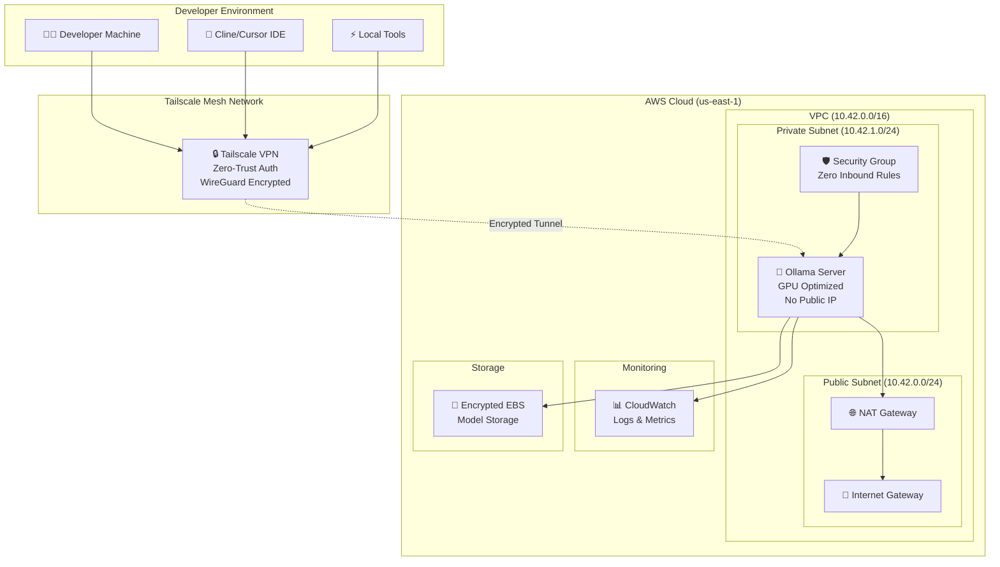

# 🦙 Ollama Cloud Engine

Deploy a secure, scalable Ollama server on AWS or GCP in minutes. Features Tailscale-only access, automatic cost tracking, and enterprise-grade security.

<div align="center">

[](https://opentofu.org) 
[](https://aws.amazon.com) 
[](https://cloud.google.com) 
[](https://tailscale.com) 
[](https://www.infracost.io)
[](LICENSE)

</div>

## ✨ Features

- **🔒 Zero-Trust Security**: Tailscale mesh VPN with no SSH or public IPs
- **⚡ One-Command Deployment**: Single command
- **💰 Cost Transparency**: Automatic infrastructure cost estimation with Infracost
- **🎯 AI-Optimized**: Pre-configured GPU instances for optimal LLM performance
- **📊 Enterprise Monitoring**: AWS CloudWatch integration; GCP logging optional
- **🔧 Developer-Friendly**: Choice of Docker or native CLI workflows

## 🏗️ Architecture



**What gets deployed:**
- **VPC**: Dedicated network (10.42.0.0/16) with public/private subnets
- **Security**: Zero inbound rules, Tailscale-only access
- **Compute**: GPU-optimized EC2 with automatic model selection
- **Storage**: Encrypted EBS volumes sized per model requirements
- **Monitoring**: CloudWatch logs and metrics collection
- **Networking**: NAT Gateway for outbound connectivity (model downloads)

## 🚀 Quick Start

### Prerequisites

**Required for all setups:**
- [Task](https://taskfile.dev) (for task execution)
- [Tailscale](https://tailscale.com) account and auth key

**Choose one of the following:**

**Option A: Docker**
- Docker or Docker-compatible container runtime (Podman, Colima, etc.)
- Ensure the `docker` command is available in your PATH

**Option B: Local CLI Tools**
- [Infracost](https://www.infracost.io/docs/#quick-start)
- [OpenTofu](https://opentofu.org/docs/intro/install/)

### GPU quota requirements

- AWS: For G-family GPUs you need vCPU quota in the EC2 quota "Running On-Demand G and VT instances" for your target region. Minimum: 4–8 vCPUs depending on instance.
- GCP: Enable Compute Engine API and request GPU quota in your chosen region/zone (e.g., T4/A100 availability varies by zone).

#### Getting a Tailscale Auth Key

1. **Create an auth key** in your [Tailscale Admin Console](https://login.tailscale.com/admin/settings/keys)
2. **Click "Generate auth key"** and configure:
   - **Description**: "Ollama Cloud Engine" (or your preference)
   - ✅ **Reusable**: Enable for multiple deployments
   - ✅ **Ephemeral**: Node auto-removes when disconnected
   - **Expiry**: Set to match your project timeline
   - **Tags**: Optional, for access control policies
3. **Copy the key** - it starts with `tskey-`

> 📖 **Documentation**: [Tailscale Auth Keys Guide](https://tailscale.com/kb/1085/auth-keys)  
> ⏰ **Key Expiry**: See [Key expiry details](https://tailscale.com/kb/1028/key-expiry)

### Option A: Docker Workflow

1. **Create configuration file**
   ```bash
   # vars.env
    CLOUD=aws                                                     # aws | gcp
    TF_VAR_tailscale_auth_key=tskey-auth-xxx...                   # required
    TF_VAR_model_choice=codellama:7b-code                         # required
    TF_VAR_instance_name=Ollama-LLM-Server                        # optional
    TF_VAR_enable_debug=false                                     # optional

    # If CLOUD=aws
    TF_VAR_aws_region=us-east-1                                   # optional
    TF_VAR_aws_profile=default                                     # optional
    TF_VAR_custom_ami_id=ami-xxxxxxxxxxxxxxxxx                     # optional

    # If CLOUD=gcp
    TF_VAR_gcp_credentials_path=/work/.gcp/creds.json               # required for docker tasks on GCP
    TF_VAR_gcp_project=your-project-id                             # required for GCP
    TF_VAR_gcp_region=us-central1                                  # optional
    TF_VAR_gcp_zone=us-central1-a                                  # optional
   ```

2. **Deploy infrastructure**
   ```bash
    task docker:create   # uses CLOUD from vars.env; docker mounts .gcp/creds.json automatically
   ```

3. **Manage your deployment**
   No cloud CLIs or extra commands needed; tasks read `vars.env` and handle everything.
   ```bash
     # Status (reads CLOUD from vars.env)
     task cli:status

     # Start/stop
    task cli:start
    task cli:stop

    # Destroy when done
    task docker:destroy
   ```

### Option B: Local CLI Workflow

1. **Install dependencies (macOS)**
   ```bash
   task cli:setup:mac
   ```

2. **Set environment variables**
    Put all values in vars.env; Task auto-loads it.
    See Docker workflow step 1 for an example vars.env.

3. **Deploy and manage**
   ```bash
    # Deploy infrastructure
    task cli:create   # uses CLOUD from vars.env

    # Manage deployment
    task cli:status
    task cli:start
    task cli:stop
    task cli:destroy
   ```

## ⚙️ Configuration

### Environment Variables

Create a `vars.env` file (Task auto-loads this). For docker tasks on GCP, set `TF_VAR_gcp_credentials_path=/work/.gcp/creds.json` and place your service account at `~/.gcp/creds.json` (the task mounts it into the container). Alternatively, you can store it at `.gcp/creds.json` in the repo (gitignored).

| Variable | Required | Default | Description |
|----------|----------|---------|-------------|
| `CLOUD` | **Yes** | `aws` | Target cloud: `aws` or `gcp` |
| `TF_VAR_tailscale_auth_key` | **Yes** | - | Tailscale authentication key |
| `TF_VAR_model_choice` | **Yes** | - | Ollama model to deploy (see [supported models](#supported-models)) |
| `TF_VAR_instance_name` | No | `Ollama-LLM-Server` | Instance and Tailscale hostname |
| `TF_VAR_enable_debug` | No | `false` | Enable debug logging for Ollama |
| `TF_VAR_aws_region` | AWS only | `us-east-1` | AWS deployment region |
| `TF_VAR_aws_profile` | AWS only | `default` | AWS profile name |
| `TF_VAR_custom_ami_id` | AWS only | - | Override automatic GPU DLAMI selection |
| `TF_VAR_gcp_project` | GCP only | - | GCP project ID |
| `TF_VAR_gcp_region` | GCP only | `us-central1` | GCP region |
| `TF_VAR_gcp_zone` | GCP only | `us-central1-a` | GCP zone |

### Supported Models

The following models are supported with automatic GPU instance selection:

| Model | AWS Instance | GCP Machine/GPU | Storage | Use Case |
|-------|--------------|-----------------|---------|----------|
| `codellama:7b-code` | g5.xlarge | n1-standard-8 + T4 | 100GB | Code completion, small projects |
| `codellama:13b-code` | g5.2xlarge | n1-standard-16 + T4 | 150GB | Advanced code generation |
| `codellama:34b-code` | g6e.xlarge | A2 (A100 1g) | 200GB | Complex code analysis |
| `qwen2.5-coder:32b` | g6e.xlarge | A2 (A100 1g) | 200GB | Multilingual code generation |
| `mistralai/Mistral-7B-Instruct-v0.1` | g5.xlarge | n1-standard-8 + T4 | 100GB | General instruction following |
| `deepseek-coder:6.7b-base` | g5.xlarge | n1-standard-8 + T4 | 100GB | Code understanding |
| `llama3:8b-instruct-q5_1` | g5.xlarge | n1-standard-8 (CPU OK) | 100GB | General purpose, quantized |

## 🔧 Usage with AI Coding Tools

### Cline

After deployment, configure Cline to use your Ollama server:

1. **Get your Tailscale URL** (from deployment output):
   ```
   http://Ollama-LLM-Server:11434
   ```

2. **Configure Cline**:
   - Provider: `ollama`
   - Model: Your `TF_VAR_model_choice` value
   - Base URL: `http://Ollama-LLM-Server:11434`

### Other Tools

The Ollama API is compatible with:
- **Continue.dev**: VS Code/JetBrains plugin
- **Open WebUI**: Web-based interface
- **LangChain**: Python/JS framework
- **Custom applications**: Standard OpenAI-compatible API
